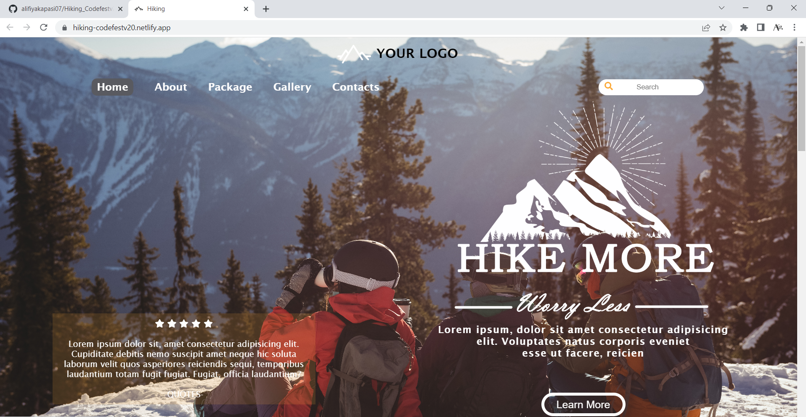
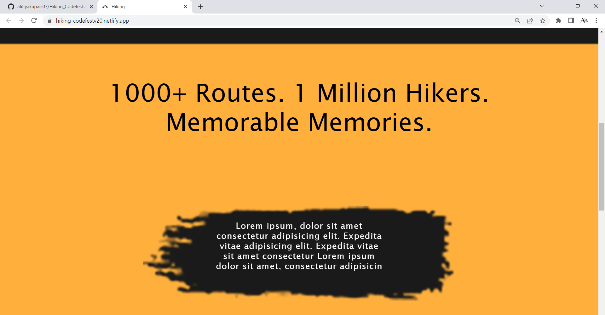
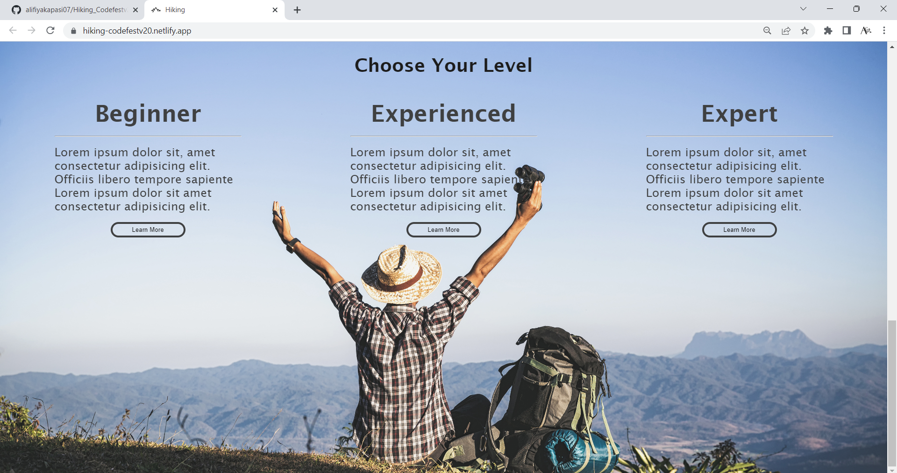

# Hiking_Codefestv2.0
> https://hiking-codefestv20.netlify.app/

## Website Preview
### Main Page

### Features

### Footer

  

## Features 📋
⚡️ Fully Responsive
⚡️ Easy to modify

## Sections 📚
✔️ Home\
✔️ About Us\
✔️ Package\
✔️ Gallery \
✔️ Contact

## Tools Used 🛠️
* <b>Netlify</b> - To host my static website (HTML, CSS, JS).
